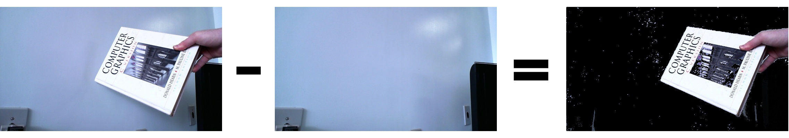

## Implementation of Real-time foreground–background segmentation using codebook model

Codebook Foreground-Background segmentation application, based on [*Kim et al.* paper](http://www.sciencedirect.com/science/article/pii/S1077201405000057) from 2005. Also, added HLS, HSV, LAB and YCrCb color spaces to compute codewords, instead of only RGB.

* Kyungnam Kim, Thanarat H. Chalidabhongse, David Harwood, Larry Davis, Real-time foreground–background segmentation using codebook model, Real-Time Imaging, Volume 11, Issue 3, 2005, Pages 172-185, ISSN 1077-2014, https://doi.org/10.1016/j.rti.2004.12.004.

### Project settings

---

* Developed on C++, using Visual Studio 2017

* [OpenCV 4.0.1](https://opencv.org/)

    * [Documentation](https://docs.opencv.org/4.0.1/)
    
    * Set OPENCV_PATH to "../opencv/build/"

    * Copy .dll files to bin/x64/(Release, Debug) folder

* [OpenCV C++ Tutorial](https://www.opencv-srf.com)

* For videos, must download .dll from https://github.com/cisco/openh264/releases
    
### Example

---

